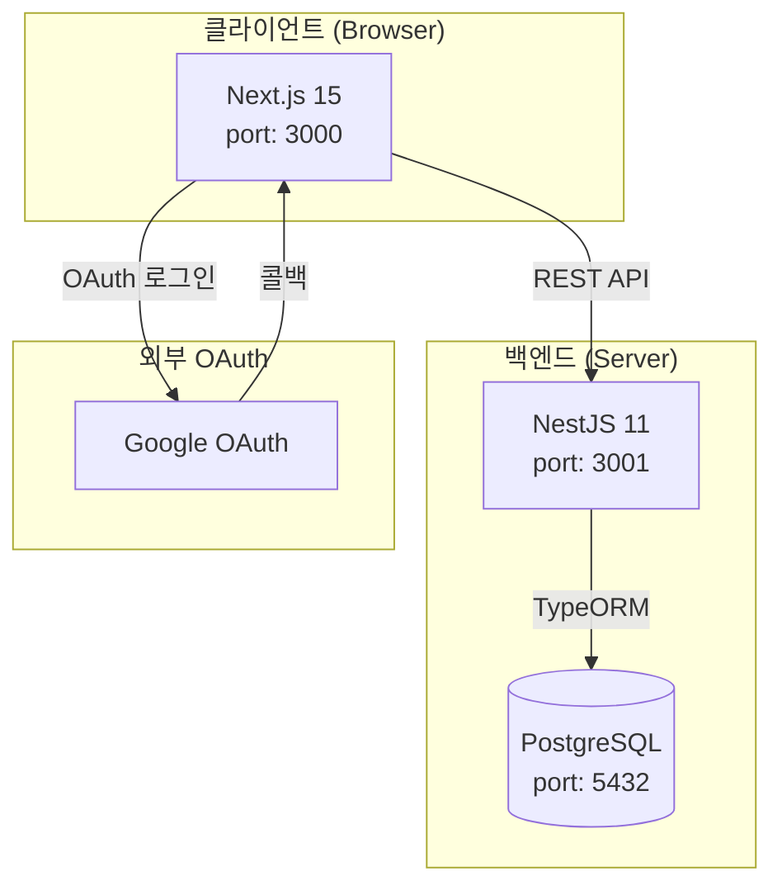
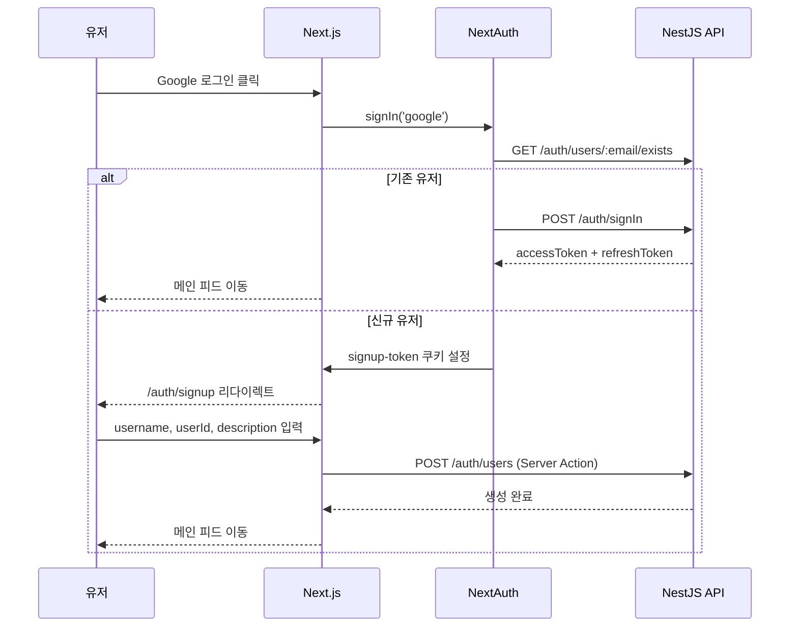

# dev.log — Frontend

개인 블로그 플랫폼 **dev.log**의 프론트엔드 레포지토리.  
Next.js 15 App Router 기반으로 포스트 작성, 무한 스크롤 피드, OAuth 인증을 제공한다.

---

## 기술 스택

| 항목 | 기술 | 버전 |
|------|------|------|
| 프레임워크 | Next.js (App Router) | 15.1.9 |
| 언어 | TypeScript | 5 |
| UI | React | 19 |
| 스타일링 | TailwindCSS | v4 |
| UI 컴포넌트 | Radix UI (shadcn/ui) | — |
| 클라이언트 상태 | Zustand | v5 |
| 서버 상태 | TanStack React Query | v5 |
| 인증 | NextAuth | v5 beta |
| 에디터 | TipTap | v2 |
| 스키마 검증 | Zod | — |
| 날짜 처리 | dayjs | — |
| 알림 | Sonner | — |

---

## 시작하기

### 사전 요구사항

- Node.js 20+
- 백엔드 서버 실행 중 (`http://localhost:3001`)

### 환경 변수 설정

`.env` 파일을 생성하고 아래 값을 채운다.

```env
NEXT_PUBLIC_SERVER_URL=http://localhost:3001
NEXTAUTH_URL=http://localhost:3000
NEXTAUTH_SECRET=your-secret-key
GOOGLE_CLIENT_ID=your-google-client-id
GOOGLE_CLIENT_SECRET=your-google-client-secret
```

### 실행

```bash
# 의존성 설치
npm install

# 개발 서버
npm run dev

# 프로덕션 빌드
npm run build

# 프로덕션 실행
npm run start

# 린트
npm run lint
```

개발 서버: `http://localhost:3000`

---

## 아키텍처

### 시스템 구성



### 라우팅 구조

```
/                    → /new (미들웨어 리라이트)
/new                 → 최신 포스트 목록
/trends              → 인기 포스트 목록

/user/[userId]               → 유저 프로필
/user/[userId]/[postId]      → 포스트 상세
/@modal/(.)user/.../[postId] → 포스트 상세 (인터셉트 모달)

/auth                → 로그인 (Google OAuth)
/auth/signup         → 신규 유저 프로필 설정

/write               → 포스트 에디터 (인증 필요)
/settings            → 설정 (WIP)
```

미들웨어(`middleware.ts`): `/@:userId` → `/user/:userId`, `/` → `/new` 리라이트

### 반응형 레이아웃

| 구간 | 화면 너비 | 네비게이션 | 우측 위젯 |
|------|-----------|-----------|----------|
| 모바일 | < 768px | 상단 헤더 + 하단 탭바 | 없음 |
| 태블릿 | 768px ~ 1279px | 좌측 사이드바 (72px, 아이콘) | 없음 |
| 데스크탑 | 1280px ~ 1535px | 좌측 사이드바 (260px) | 없음 |
| 와이드 | ≥ 1536px | 좌측 사이드바 (260px) | 우측 위젯 (320px) |

---

## 인증 흐름



---

## 상태 관리

| 도구 | 용도 |
|------|------|
| Zustand `useTheme` | 다크/라이트 테마 (localStorage 동기화) |
| Zustand `usePostStore` | 포스트 작성 폼 상태 (title, content, tags 등) |
| TanStack React Query `useFetch` | 무한 스크롤 피드 (커서 페이지네이션) |
| React Context `PostContextProvider` | 포스트 상세 페이지 좋아요/댓글 상태 |

---

## 주요 문서

| 문서 | 경로 | 설명 |
|------|------|------|
| 아키텍처 구성도 | [docs/architecture-diagram.md](docs/architecture-diagram.md) | 시스템 전체 Mermaid 다이어그램 |
| 프론트엔드 아키텍처 | [docs/frontend-architecture.md](docs/frontend-architecture.md) | 라우팅, 상태관리, 컴포넌트, 인증 흐름 상세 |
| 작업 로그 | [docs/work-log.md](docs/work-log.md) | 날짜별 작업 내역 및 미완료 항목 |

---

## 미완성 항목

| 항목 | 상태 |
|------|------|
| 댓글 기능 연동 | WIP — 프론트 컴포넌트만 존재, 백엔드 API 미구현 |
| 트렌딩 포스트 정렬 | 미구현 |
| 유저 프로필 페이지 포스트 목록 | 미구현 |
| GitHub OAuth | 미구현 |
| `/settings` 페이지 | WIP |
| 알림 기능 | 미구현 |
| 보관함 기능 | 미구현 |
