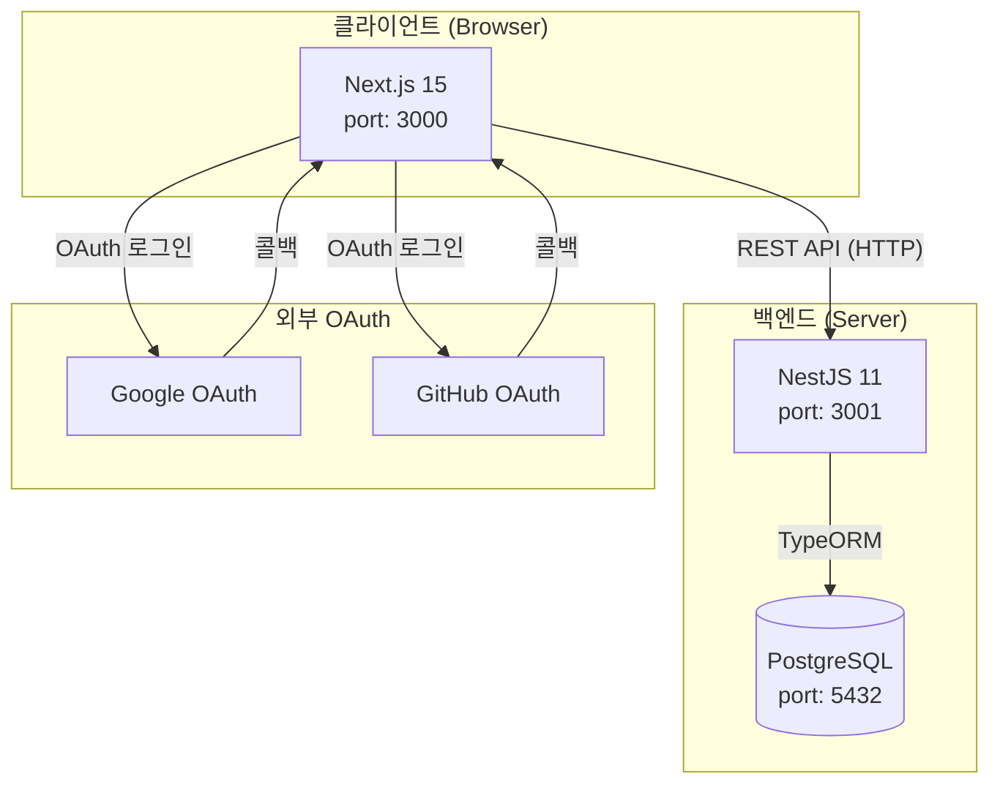
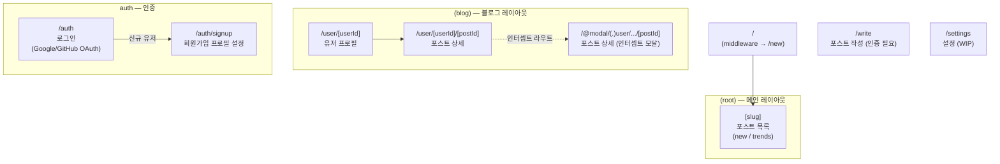
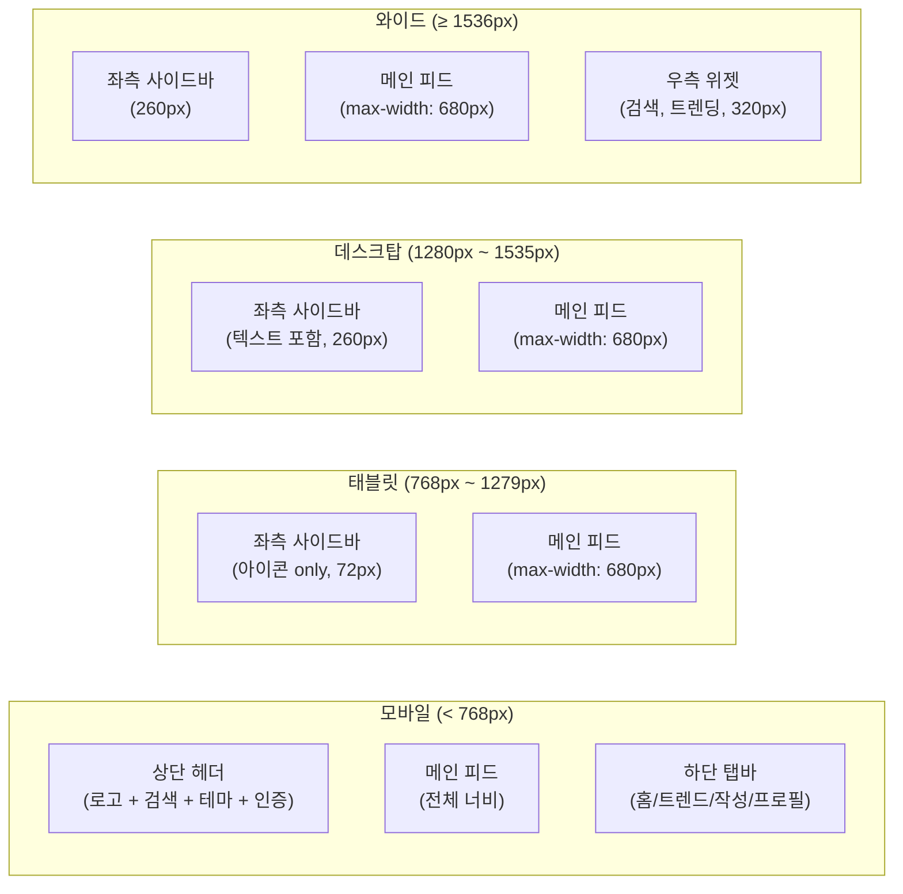
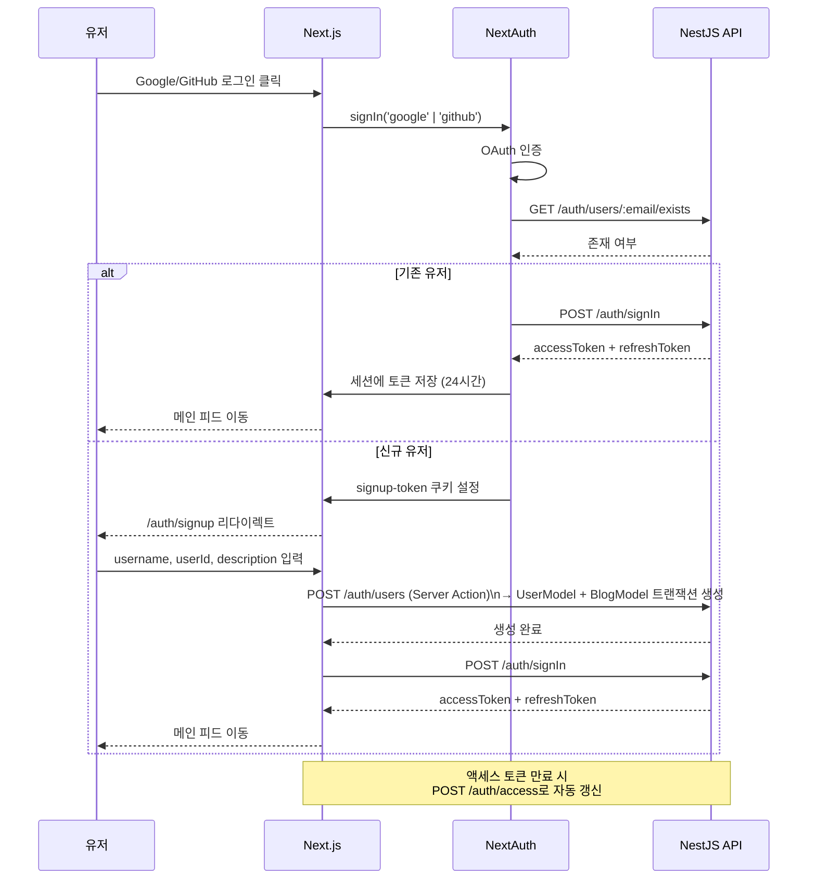
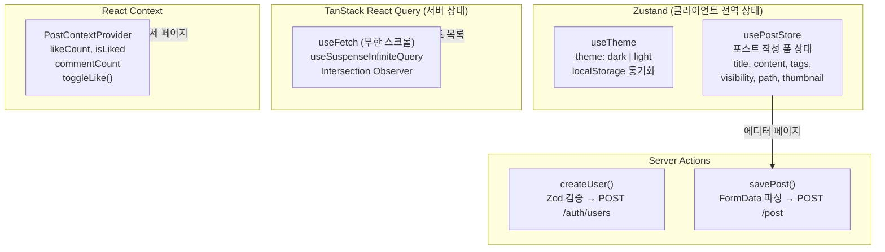
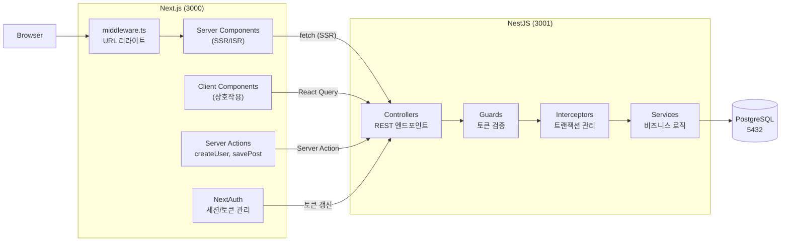

# dev.log 아키텍처 구성도

## 1. 전체 시스템 구성

```mermaid
graph TB
  subgraph Client["클라이언트 (Browser)"]
    FE["Next.js 15\nport: 3000"]
  end

  subgraph Backend["백엔드 (Server)"]
    BE["NestJS 11\nport: 3001"]
    DB[(PostgreSQL\nport: 5432)]
  end

  subgraph Auth["외부 OAuth"]
    GOOGLE["Google OAuth"]
    GITHUB["GitHub OAuth"]
  end

  FE -->|"REST API (HTTP)"| BE
  BE -->|"TypeORM"| DB
  FE -->|"OAuth 로그인"| GOOGLE
  FE -->|"OAuth 로그인"| GITHUB
  GOOGLE -->|"콜백"| FE
  GITHUB -->|"콜백"| FE
```

---

## 2. 프론트엔드 라우팅 구조

```mermaid
graph TD
  ROOT["/\n(middleware → /new)"]

  subgraph RootGroup["(root) — 메인 레이아웃"]
    SLUG["[slug]\n포스트 목록\n(new / trends)"]
  end

  subgraph BlogGroup["(blog) — 블로그 레이아웃"]
    USER_PROFILE["/user/[userId]\n유저 프로필"]
    POST_DETAIL["/user/[userId]/[postId]\n포스트 상세"]
    POST_MODAL["/@modal/(.)user/.../[postId]\n포스트 상세 (인터셉트 모달)"]
  end

  subgraph AuthGroup["auth — 인증"]
    LOGIN["/auth\n로그인\n(Google/GitHub OAuth)"]
    SIGNUP["/auth/signup\n회원가입 프로필 설정"]
  end

  WRITE["/write\n포스트 작성 (인증 필요)"]
  SETTINGS["/settings\n설정 (WIP)"]

  ROOT --> SLUG
  USER_PROFILE --> POST_DETAIL
  POST_DETAIL -.->|"인터셉트 라우트"| POST_MODAL
  LOGIN -->|"신규 유저"| SIGNUP
```

---

## 3. 반응형 레이아웃 구조

```mermaid
graph LR
  subgraph Mobile["모바일 (< 768px)"]
    M_HEADER["상단 헤더\n(로고 + 검색 + 테마 + 인증)"]
    M_FEED["메인 피드\n(전체 너비)"]
    M_NAV["하단 탭바\n(홈/트렌드/작성/프로필)"]
  end

  subgraph Tablet["태블릿 (768px ~ 1279px)"]
    T_SIDEBAR["좌측 사이드바\n(아이콘 only, 72px)"]
    T_FEED["메인 피드\n(max-width: 680px)"]
  end

  subgraph Desktop["데스크탑 (1280px ~ 1535px)"]
    D_SIDEBAR["좌측 사이드바\n(텍스트 포함, 260px)"]
    D_FEED["메인 피드\n(max-width: 680px)"]
  end

  subgraph Wide["와이드 (≥ 1536px)"]
    W_SIDEBAR["좌측 사이드바\n(260px)"]
    W_FEED["메인 피드\n(max-width: 680px)"]
    W_RIGHT["우측 위젯\n(검색, 트렌딩, 320px)"]
  end
```

---

## 4. 인증 흐름

```mermaid
sequenceDiagram
  participant U as 유저
  participant FE as Next.js
  participant NA as NextAuth
  participant BE as NestJS API

  U->>FE: Google/GitHub 로그인 클릭
  FE->>NA: signIn('google' | 'github')
  NA->>NA: OAuth 인증

  NA->>BE: GET /auth/users/:email/exists
  BE-->>NA: 존재 여부

  alt 기존 유저
    NA->>BE: POST /auth/signIn
    BE-->>NA: accessToken + refreshToken
    NA->>FE: 세션에 토큰 저장 (24시간)
    FE-->>U: 메인 피드 이동
  else 신규 유저
    NA->>FE: signup-token 쿠키 설정
    FE-->>U: /auth/signup 리다이렉트
    U->>FE: username, userId, description 입력
    FE->>BE: POST /auth/users (Server Action)\n→ UserModel + BlogModel 트랜잭션 생성
    BE-->>FE: 생성 완료
    FE->>BE: POST /auth/signIn
    BE-->>FE: accessToken + refreshToken
    FE-->>U: 메인 피드 이동
  end

  Note over FE,BE: 액세스 토큰 만료 시<br/>POST /auth/access로 자동 갱신
```

---

## 5. 상태 관리 구조

```mermaid
graph TD
  subgraph Zustand["Zustand (클라이언트 전역 상태)"]
    THEME["useTheme\ntheme: dark | light\nlocalStorage 동기화"]
    POST_STORE["usePostStore\n포스트 작성 폼 상태\ntitle, content, tags,\nvisibility, path, thumbnail"]
  end

  subgraph ReactQuery["TanStack React Query (서버 상태)"]
    INF_SCROLL["useFetch (무한 스크롤)\nuseSuspenseInfiniteQuery\nIntersection Observer"]
  end

  subgraph Context["React Context"]
    POST_CTX["PostContextProvider\nlikeCount, isLiked\ncommentCount\ntoggleLike()"]
  end

  subgraph ServerActions["Server Actions"]
    CREATE_USER["createUser()\nZod 검증 → POST /auth/users"]
    SAVE_POST["savePost()\nFormData 파싱 → POST /post"]
  end

  POST_STORE -->|"에디터 페이지"| SAVE_POST
  INF_SCROLL -->|"포스트 목록"| ReactQuery
  POST_CTX -->|"포스트 상세 페이지"| Context
```

---

## 6. 전체 데이터 흐름 요약

```mermaid
flowchart LR
  Browser["Browser"]

  subgraph FE["Next.js (3000)"]
    SC["Server Components\n(SSR/ISR)"]
    CC["Client Components\n(상호작용)"]
    MW["middleware.ts\nURL 리라이트"]
    SA["Server Actions\ncreateUser, savePost"]
    NA["NextAuth\n세션/토큰 관리"]
  end

  subgraph BE["NestJS (3001)"]
    GUARD["Guards\n토큰 검증"]
    INTER["Interceptors\n트랜잭션 관리"]
    CTRL["Controllers\nREST 엔드포인트"]
    SVC["Services\n비즈니스 로직"]
  end

  DB[(PostgreSQL\n5432)]

  Browser --> MW
  MW --> SC
  SC -->|"fetch (SSR)"| CTRL
  CC -->|"React Query"| CTRL
  SA -->|"Server Action"| CTRL
  NA -->|"토큰 갱신"| CTRL
  CTRL --> GUARD --> INTER --> SVC --> DB
```
