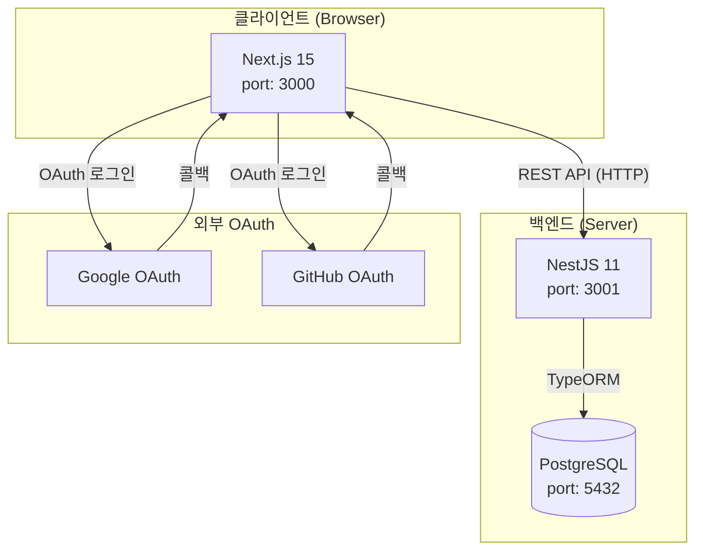
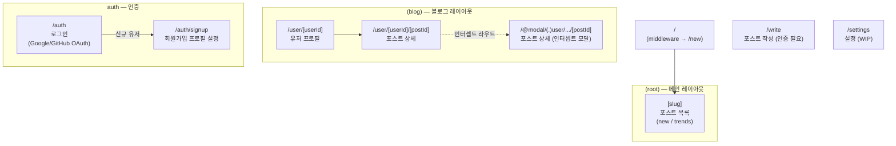
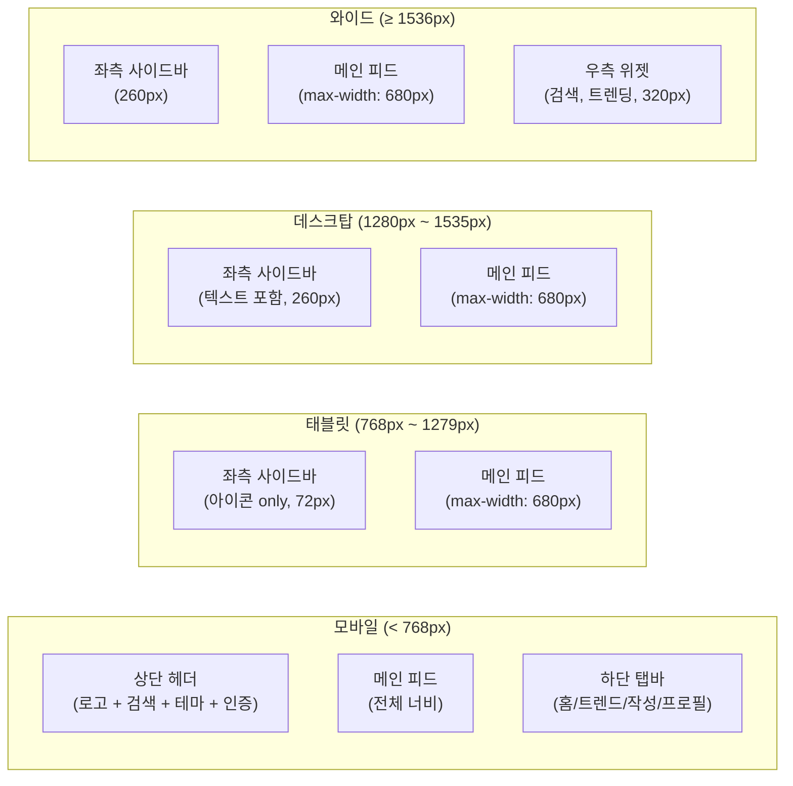
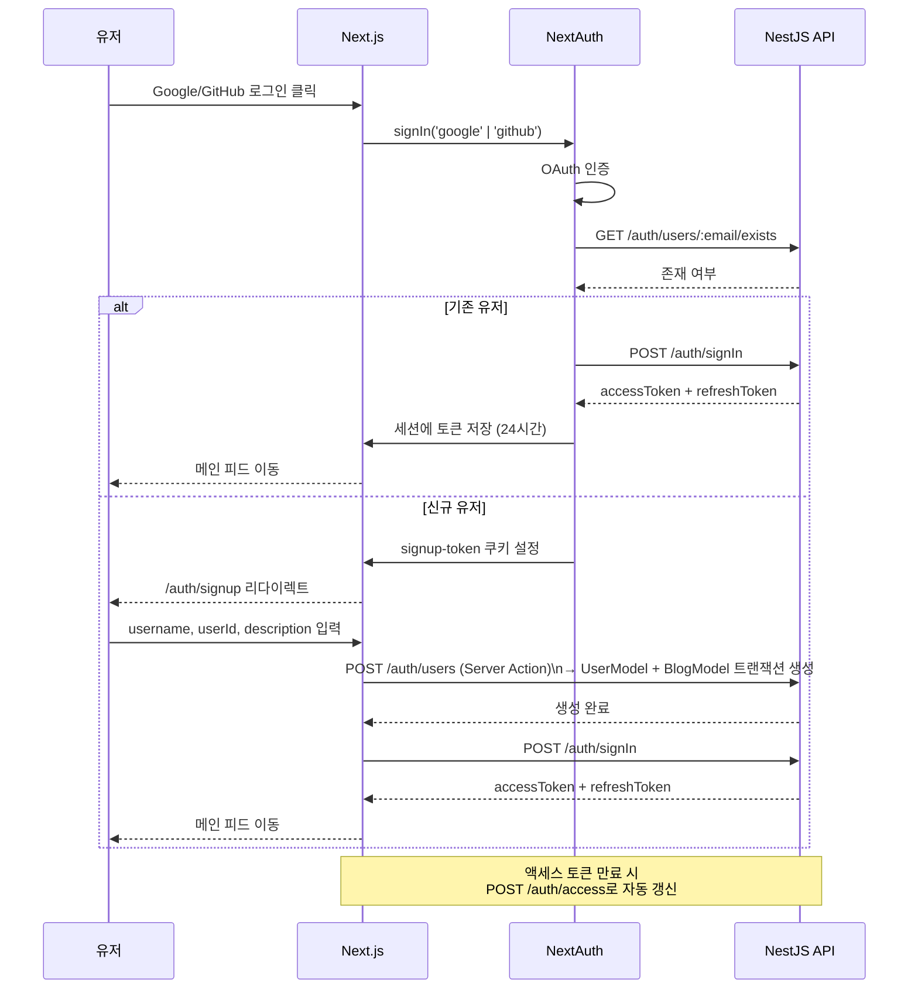
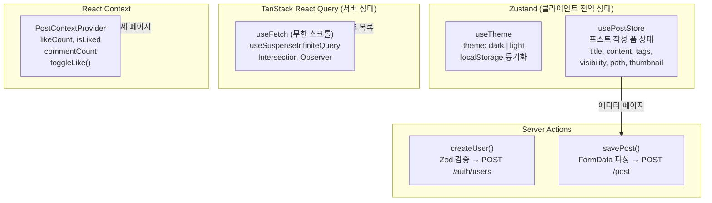
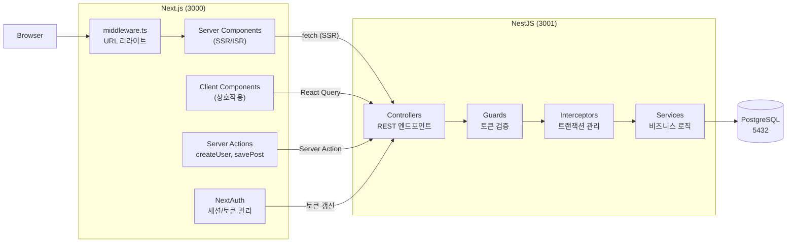

# Frontend 아키텍처 — dev.log 인수인계 문서

## 목차

1. [프로젝트 개요](#1-프로젝트-개요)
2. [기술 스택](#2-기술-스택)
3. [프로젝트 구조](#3-프로젝트-구조)
4. [라우팅 구조](#4-라우팅-구조)
5. [레이아웃 & 반응형 구조](#5-레이아웃--반응형-구조)
6. [인증 흐름](#6-인증-흐름)
7. [상태 관리](#7-상태-관리)
8. [데이터 페칭 & 서비스 레이어](#8-데이터-페칭--서비스-레이어)
9. [주요 컴포넌트](#9-주요-컴포넌트)
10. [Server Actions](#10-server-actions)
11. [유틸리티 함수](#11-유틸리티-함수)
12. [타입 정의](#12-타입-정의)
13. [환경 변수](#13-환경-변수)
14. [미완성 항목 & TODO](#14-미완성-항목--todo)

---

## 1. 프로젝트 개요

개인 블로그 플랫폼의 프론트엔드. 유저가 포스트를 작성하고, 다른 유저의 포스트에 좋아요·댓글을 남길 수 있다.
백엔드(`http://localhost:3001`)와 REST API로 통신한다.

- **개발 서버**: `http://localhost:3000`
- **백엔드 API**: `http://localhost:3001` (`NEXT_PUBLIC_SERVER_URL`)
- **실행 명령**: `npm run dev`

### 전체 시스템 구성



---

## 2. 기술 스택

| 항목 | 기술 | 버전 | 용도 |
|------|------|------|------|
| 프레임워크 | Next.js (App Router) | 15.1.9 | SSR/ISR/CSR 혼합 렌더링 |
| 언어 | TypeScript | - | 타입 안전성 |
| UI | React | 19 | 컴포넌트 기반 UI |
| 스타일링 | TailwindCSS | v4 | 유틸리티 CSS |
| UI 컴포넌트 | Radix UI (shadcn/ui) | - | 접근성 기반 기본 컴포넌트 |
| 클라이언트 상태 | Zustand | v5 | 포스트 작성 폼, 테마 전역 상태 |
| 서버 상태 | TanStack React Query | v5 | 무한 스크롤, 서버 데이터 캐싱 |
| 인증 | NextAuth | v5 beta | OAuth 세션 관리 (Google/GitHub) |
| 에디터 | TipTap | v2 | 리치 텍스트 에디터 |
| 스키마 검증 | Zod | - | Server Action 입력값 검증 |
| 날짜 처리 | dayjs | - | 날짜 포맷, 상대 시간 표시 |
| 알림 | Sonner | - | 토스트 알림 |

---

## 3. 프로젝트 구조

```
src/
├── app/                                # Next.js App Router 진입점
│   ├── layout.tsx                      # 루트 레이아웃
│   │                                   #  - ThemeProvider (테마 초기화)
│   │                                   #  - Providers (NextAuth + ReactQuery)
│   │                                   #  - Toaster (Sonner 전역 알림)
│   ├── schema.ts                       # Zod 스키마 & 공통 타입 정의
│   ├── globals.css                     # CSS 변수 기반 테마 (light/dark)
│   │
│   ├── (root)/                         # 메인 피드 레이아웃 그룹
│   │   ├── layout.tsx                  # Header + SidebarNav + MobileBottomNav
│   │   ├── [slug]/page.tsx             # 포스트 목록 (new | trends)
│   │   └── components/
│   │       ├── header.tsx              # 모바일 전용 상단 헤더 (md:hidden)
│   │       ├── sidebar-nav.tsx         # 데스크탑 좌측 사이드바 (hidden md:block)
│   │       ├── sidebar-widgets.tsx     # 데스크탑 우측 위젯 (hidden 2xl:block)
│   │       └── mobile-bottom-nav.tsx   # 모바일 하단 탭바 (md:hidden)
│   │
│   ├── (blog)/                         # 블로그/유저 레이아웃 그룹
│   │   └── user/
│   │       ├── [userId]/
│   │       │   ├── page.tsx            # 유저 프로필 페이지
│   │       │   └── [postId]/page.tsx   # 포스트 상세 페이지
│   │       └── @modal/
│   │           └── (.)user/[userId]/[postId]/
│   │               └── page.tsx        # 인터셉트 라우트 (모달로 포스트 표시)
│   │
│   ├── auth/
│   │   ├── page.tsx                    # 로그인 페이지 (Google/GitHub OAuth)
│   │   └── signup/page.tsx            # 신규 유저 프로필 설정
│   │
│   ├── write/page.tsx                  # 포스트 에디터 (인증 필요)
│   ├── settings/page.tsx               # 설정 페이지 (WIP)
│   └── api/auth/[...nextauth]/         # NextAuth API 핸들러
│
├── actions/
│   └── actions.ts                      # Server Actions (createUser, savePost)
│
├── components/
│   ├── providers.tsx                   # 전역 Provider 래퍼
│   ├── layout/                         # 레이아웃 컴포넌트
│   │   ├── page-layout.tsx             # 최대 너비 + 반응형 컨테이너
│   │   ├── post-layout.tsx             # 포스트 에디터 전용 레이아웃
│   │   ├── user-layout.tsx             # 유저 프로필 레이아웃
│   │   └── card-layout.tsx             # 포스트 카드 그리드
│   ├── post/                           # 포스트 컴포넌트
│   │   ├── post-card.tsx               # 썸네일, 제목, 요약, 메타 카드
│   │   ├── post-card-list.tsx          # 무한 스크롤 카드 목록
│   │   ├── post-meta.tsx               # 날짜, 댓글 수, 좋아요 수
│   │   └── post-context-provider.tsx   # 좋아요/댓글 상태 Context Provider
│   ├── editor/                         # 에디터 컴포넌트
│   │   ├── post-editor.tsx             # 전체 에디터 래퍼 (제목 + 태그 + 본문)
│   │   ├── editor.tsx                  # TipTap 리치 텍스트 에디터
│   │   ├── tag-editor.tsx              # 태그 입력 / 자동완성
│   │   ├── post-setting.tsx            # 공개설정, URL, 요약, 썸네일 모달
│   │   └── image-file-upload.tsx       # 드래그앤드롭 썸네일 업로드
│   ├── comment/                        # 댓글 컴포넌트
│   │   ├── comments.tsx                # 댓글 섹션 래퍼
│   │   ├── comments-list.tsx           # 중첩 댓글 목록
│   │   └── comment-item.tsx            # 개별 댓글 (depth 기반 중첩)
│   ├── auth/                           # 인증 컴포넌트
│   │   ├── profile-setup-form.tsx      # 회원가입 폼
│   │   ├── login-button.tsx            # 인증된 유저 드롭다운
│   │   └── not-login-button.tsx        # 비로그인 상태 버튼
│   ├── profile/
│   │   └── profile.tsx                 # 헤더 프로필 섹션 (ThemeToggle 포함)
│   ├── theme/
│   │   ├── theme-toggle.tsx            # 다크/라이트 모드 토글 버튼
│   │   └── theme-provider.tsx          # localStorage 테마 복원
│   └── ui/                            # shadcn/ui 기본 컴포넌트
│
├── hooks/
│   ├── fetch.tsx                       # useFetch: 무한 스크롤 (React Query 래퍼)
│   ├── post.ts                         # usePostStore: 포스트 작성 폼 Zustand 스토어
│   └── theme.ts                        # useTheme: 다크/라이트 테마 Zustand 스토어
│
├── services/
│   ├── auth.service.ts                 # signIn, rotateToken
│   ├── user.service.ts                 # has, create, findAll, findUserByEmail, findUserById
│   └── post.service.ts                # create, getList, findPost, like
│
├── types/
│   └── type.ts                         # IPost, FetchPostsResponse 등 공통 타입
│
├── utils/
│   ├── index.ts                        # cn, base64, parseFormData, isEmpty, getTimeDiff 등
│   └── db/index.ts                     # fetch 기반 API 클라이언트
│
├── auth.ts                             # NextAuth 설정 (Google Provider, JWT 콜백)
└── middleware.ts                       # URL 리라이트 미들웨어
```

---

## 4. 라우팅 구조

```
/                    → /new (middleware 리라이트)
/new                 → 최신 포스트 목록
/trends              → 인기 포스트 목록 (WIP)

/user/[userId]               → 유저 프로필 페이지
/user/[userId]/[postId]      → 포스트 상세 페이지
/@modal/(.)user/.../[postId] → 포스트 상세 (인터셉트 모달 — 이전 페이지 유지)

/auth                → 로그인 페이지 (Google/GitHub OAuth)
/auth/signup         → 신규 유저 프로필 설정

/write               → 포스트 작성 에디터 (미인증 시 /auth 리다이렉트)
/settings            → 설정 (WIP)
```

### 라우팅 구조 다이어그램



### 미들웨어 (`middleware.ts`)

| 진입 경로 | 리라이트 대상 | 설명 |
|-----------|--------------|------|
| `/` | `/new` | 루트 접근 시 최신 피드로 이동 |
| `/@:userId` | `/user/:userId` | 단축 URL 지원 |

### 정적 생성 (ISR)

`/user/[userId]` 및 `/user/[userId]/[postId]` 페이지에 `generateStaticParams()` 적용:
- 빌드 시 백엔드 API에서 전체 유저/포스트 목록 fetch
- 사전 렌더링으로 초기 로딩 성능 향상

---

## 5. 레이아웃 & 반응형 구조

### 브레이크포인트

| 구간 | 화면 너비 | 헤더 | 네비게이션 | 우측 위젯 |
|------|-----------|------|-----------|----------|
| 모바일 | < 768px | 상단 헤더 | 하단 탭바 | 없음 |
| 태블릿 | 768px ~ 1279px | 없음 | 좌측 사이드바 (72px, 아이콘만) | 없음 |
| 데스크탑 | 1280px ~ 1535px | 없음 | 좌측 사이드바 (260px, 텍스트 포함) | 없음 |
| 와이드 | ≥ 1536px | 없음 | 좌측 사이드바 (260px) | 우측 위젯 (320px) |

### 반응형 레이아웃 다이어그램



### 레이아웃 컴포넌트 계층

```
RootLayout (app/layout.tsx)
├── ThemeProvider      — localStorage에서 테마 복원 (dark/light)
├── Providers          — NextAuth SessionProvider + ReactQueryProvider
└── Toaster            — Sonner 전역 알림

(root)/layout.tsx
├── Header             — 모바일 전용 (md:hidden)
│   └── Profile        — ThemeToggle + Search + Bell + Auth 버튼
├── SidebarNav         — 데스크탑 (hidden md:block)
│   ├── 로고
│   ├── 홈 / 트렌드 / 알림 / 보관함
│   ├── Write 버튼
│   └── 유저 프로필
├── [children]         — 메인 피드 (max-width: 680px, border-r)
├── SidebarWidgets     — 와이드 전용 (hidden 2xl:block, 320px)
│   ├── 검색창
│   ├── Premium 배너
│   └── 트렌딩 토픽
└── MobileBottomNav    — 모바일 전용 (md:hidden)
    └── 홈 / 트렌드 / 작성 / 프로필
```

### 테마 시스템

**CSS 변수** (`globals.css`):

```css
:root {
  --background: oklch(0.9702 0 0);
  --foreground: oklch(0.145 0 0);
  --border: ...;
}
.dark {
  --background: oklch(0.145 0 0);
  --foreground: oklch(0.985 0 0);
}
```

**동작 방식:**
1. `useTheme().setTheme(theme)` 호출
2. `localStorage`에 `theme` 값 저장
3. `html`, `body` 요소에 `dark` 클래스 추가/제거
4. Tailwind `dark:` 유틸리티 클래스로 다크 모드 스타일 적용

> **TODO**: 데스크탑에서는 헤더가 숨김 처리되어 ThemeToggle이 보이지 않음. 좌측 사이드바 하단에 추가 필요.

---

## 6. 인증 흐름



```
1. 유저 → /auth 에서 Google 버튼 클릭
2. NextAuth OAuth 처리 (Google Provider)
3. signIn() 콜백 실행:
   ├── GET /auth/users/:email/exists → 유저 존재 여부 확인
   ├── 기존 유저 → jwt() 콜백으로 바로 진행
   └── 신규 유저 → signup-token 쿠키 설정 (15분, base64) + /auth/signup 리다이렉트
4. /auth/signup:
   └── ProfileSetupForm → username(표시명), userId(ID), description 입력
       └── createUser Server Action 호출
           ├── Zod RegisterSchema 검증
           └── POST /auth/users → UserModel + BlogModel 트랜잭션 생성
5. jwt() 콜백:
   └── POST /auth/signIn (email + provider) → accessToken + refreshToken 발급
6. 세션 저장: userId, accessToken, refreshToken (세션 최대 24시간)
7. 이후 요청:
   └── jwtDecode로 accessToken 만료 감지 → POST /auth/access로 자동 갱신
```

### NextAuth 설정 (`auth.ts`)

| 항목 | 값 |
|------|-----|
| 세션 방식 | JWT |
| 세션 유효시간 | 24시간 |
| 로그인 페이지 | `/auth` |
| 에러 페이지 | `/error` |
| OAuth Provider | Google (GitHub 미구현) |

---

## 7. 상태 관리

### 상태 관리 구조 다이어그램



### Zustand — 클라이언트 전역 상태

#### `useTheme` (`hooks/theme.ts`)

```typescript
interface Theme {
  theme: 'dark' | 'light'
  setTheme: (theme: Themes) => void
  // 호출 시: localStorage 저장 + html/body 클래스 동기화
}
```

#### `usePostStore` (`hooks/post.ts`)

포스트 작성 에디터 `/write` 의 폼 상태 관리

```typescript
interface PostStore {
  title: string
  content: string       // TipTap HTML 문자열
  tags: string[]
  visibility: boolean   // 공개(true) / 비공개(false)
  path: string          // URL 슬러그 (예: my-first-post)
  thumbnail: string     // 썸네일 URL
  summary: string       // 포스트 요약 (최대 100자)
  file: File | null     // 썸네일 파일 객체
  // setTitle, setContent, setTags ... 각 setter
}
```

### TanStack React Query — 서버 상태

#### `useFetch` (`hooks/fetch.tsx`)

```typescript
const { data, lastPostRef } = useFetch()
// data: pages[] (무한 스크롤 데이터)
// lastPostRef: 마지막 포스트 요소에 연결 → 뷰포트 진입 시 자동 다음 페이지 요청
```

- `useSuspenseInfiniteQuery` 기반
- `Intersection Observer`로 스크롤 감지
- 백엔드 커서 페이지네이션(`cursor`)과 연동

### React Context

#### `PostContextProvider` (`components/post/post-context-provider.tsx`)

포스트 상세 페이지 전용. 좋아요/댓글 상태를 하위 컴포넌트에 공유.

```typescript
interface PostContextValue {
  likeCount: number
  isLiked: boolean
  commentCount: number
  toggleLike(): void   // 미인증 시 /auth 리다이렉트, 인증 시 좋아요 토글 API 호출
  saveComment(): void  // WIP
}
```

---

## 8. 데이터 페칭 & 서비스 레이어

### 전체 데이터 흐름 다이어그램



### API 클라이언트 (`utils/db/index.ts`)

- `baseURL`: `process.env.NEXT_PUBLIC_SERVER_URL` (기본: `http://localhost:3001`)
- URL 파라미터 자동 직렬화
- 응답 에러 파싱 처리

### `services/auth.service.ts`

| 함수 | 메서드 | 경로 | 설명 |
|------|--------|------|------|
| `signIn(email, provider)` | POST | `/auth/signIn` | 로그인, 토큰 발급 |
| `rotateToken(refreshToken)` | POST | `/auth/access` | 액세스 토큰 갱신 |

### `services/user.service.ts`

| 함수 | 메서드 | 경로 | 설명 |
|------|--------|------|------|
| `has(email)` | GET | `/auth/users/:email/exists` | 이메일 존재 여부 확인 |
| `create(user)` | POST | `/auth/users` | 유저 + 블로그 생성 |
| `findAll()` | GET | `/auth/users` | 전체 유저 목록 |
| `findUserByEmail(email)` | GET | `/auth/users/email/:email` | 이메일로 유저 조회 |
| `findUserById(id)` | GET | `/auth/users/:userId` | ID로 유저 조회 |

### `services/post.service.ts`

| 함수 | 메서드 | 경로 | 설명 |
|------|--------|------|------|
| `create(post, token)` | POST | `/post` | 포스트 생성 |
| `getList(cursor)` | GET | `/post?cursor=num` | 포스트 목록 (커서 페이지네이션) |
| `findPost(userId, postId)` | GET | `/post/:userId/:postId` | 포스트 상세 조회 |
| `like(postId, isLiked, token)` | POST/DELETE | `/post/like/:postId` | 좋아요 추가/취소 |

---

## 9. 주요 컴포넌트

### 레이아웃

| 컴포넌트 | 역할 |
|----------|------|
| `PageLayout` | 최대 너비 + 반응형 컨테이너 (전체 페이지 공통) |
| `PostLayout` | 포스트 에디터 전용 레이아웃 |
| `UserLayout` | 유저 프로필 페이지 레이아웃 |
| `CardLayout` | 포스트 카드 그리드 래퍼 |

### 포스트

| 컴포넌트 | 역할 |
|----------|------|
| `PostCard` | 썸네일, 제목, 요약, 작성자, 날짜, 좋아요/댓글 수 카드 |
| `PostCardList` | `useFetch` + `lastPostRef`를 이용한 무한 스크롤 목록 |
| `PostMeta` | 날짜, 댓글 수, 좋아요 수 표시 |
| `PostContextProvider` | 포스트 상세 페이지 좋아요/댓글 상태 Provider |

### 에디터

| 컴포넌트 | 역할 |
|----------|------|
| `PostEditor` | 제목 입력 + `TagEditor` + `Editor` + 발행 버튼 |
| `Editor` | TipTap 기반 리치 텍스트 에디터 (Bold, Italic, 코드블록 등) |
| `TagEditor` | 태그 입력 및 자동완성 UI |
| `PostSetting` | 공개설정, URL 슬러그, 요약, 썸네일 설정 모달 (`savePost` 트리거) |
| `ImageFileUpload` | 드래그앤드롭 + 클릭 썸네일 이미지 업로드 |

### 댓글

| 컴포넌트 | 역할 |
|----------|------|
| `Comments` | 댓글 섹션 전체 래퍼 (입력창 포함) |
| `CommentsList` | 중첩 댓글 목록 렌더링 (재귀 구조) |
| `CommentItem` | 개별 댓글 — `level`, `pid` 기반 들여쓰기 처리 |

### 인증

| 컴포넌트 | 역할 |
|----------|------|
| `ProfileSetupForm` | 신규 유저 회원가입 폼 (username, userId, description 입력) |
| `LoginButton` | 인증된 유저 — 아바타 클릭 시 드롭다운 메뉴 (로그아웃 포함) |
| `NotLoginButton` | 비로그인 상태 — `/auth`로 이동하는 로그인 버튼 |

---

## 10. Server Actions

파일: `actions/actions.ts`

### `createUser`

```
1. signup-token 쿠키에서 이메일, provider 정보 추출 (base64 디코딩)
2. Zod RegisterSchema로 입력값 검증
   - email, name, userId (영문/숫자, 최대 20자), description, provider
3. POST /auth/users → 백엔드에서 UserModel + BlogModel 트랜잭션 생성
4. 성공/실패 상태 반환 → 클라이언트에서 처리
```

### `savePost`

```
1. getServerSession()으로 accessToken 취득 (미인증 시 에러)
2. FormData 파싱:
   - title (string), content (HTML string)
   - visibility (boolean), file (File | null)
   - path (URL 슬러그), summary (string), tags (string[])
3. POST /post (Authorization: Bearer accessToken)
4. 성공/실패 상태 반환
```

---

## 11. 유틸리티 함수

파일: `utils/index.ts`

| 함수 | 설명 |
|------|------|
| `cn(...classes)` | clsx + tailwind-merge 클래스 병합 (조건부 클래스 처리) |
| `stringToBase64(str)` | 문자열 → Base64 인코딩 |
| `base64ToString(str)` | Base64 → 문자열 디코딩 |
| `parseFormData(formData)` | FormData → 타입 변환된 객체 파싱 |
| `isEmpty(value)` | null / undefined / 빈 배열 / 빈 객체 여부 체크 |
| `getTimeDiff(date)` | 상대 시간 포맷 (예: "2시간 전", "3일 전") |
| `getTimeFormat(date, format)` | dayjs 기반 날짜 포맷 |
| `validatePost(title, content)` | 포스트 발행 전 제목/본문 유효성 검사 |

---

## 12. 타입 정의

### `app/schema.ts` (Zod)

```typescript
const RegisterSchema = z.object({
  email: z.string().email(),
  name: z.string(),
  userId: z.string().max(20),
  description: z.string().optional(),
  provider: z.enum(['google', 'github', 'email']),
})
type ProviderType = 'google' | 'github' | 'email'
```

### `types/type.ts`

```typescript
interface IPost {
  id: number
  title: string
  summary: string
  content: string
  thumbnail: string
  path: string
  visibility: boolean
  created_at: string
  updated_at: string
  likeCount: number
  commentCount: number
  isLike: boolean       // 현재 유저의 좋아요 여부
  user: {
    id: string
    user_id: string
    user_name: string
    avatar_url: string
  }
}

interface FetchPostsResponse {
  posts: IPost[]
  nextCursor: number | null
}
```

---

## 13. 환경 변수

파일: `.env` (`.env.local` 우선 적용)

| 변수 | 필수 여부 | 설명 |
|------|----------|------|
| `NEXT_PUBLIC_SERVER_URL` | 필수 | 백엔드 API URL (기본: `http://localhost:3001`) |
| `NEXTAUTH_URL` | 필수 | 앱 URL (기본: `http://localhost:3000`) |
| `NEXTAUTH_SECRET` | 필수 | NextAuth 세션 암호화 키 |
| `GOOGLE_CLIENT_ID` | 필수 | Google OAuth 클라이언트 ID |
| `GOOGLE_CLIENT_SECRET` | 필수 | Google OAuth 시크릿 |
| `GITHUB_ID` | 미구현 | GitHub OAuth App ID |
| `GITHUB_SECRET` | 미구현 | GitHub OAuth 시크릿 |

---

## 14. 미완성 항목 & TODO

| 항목 | 우선순위 | 상태 | 설명 |
|------|---------|------|------|
| 테마 토글 (데스크탑) | 높음 | 미구현 | 데스크탑에서 헤더 숨김으로 토글 버튼 없음 → 좌측 사이드바 하단 배치 필요 |
| 댓글 기능 | 중간 | WIP | 백엔드 Comment API 미구현 / 프론트 컴포넌트만 존재 |
| 트렌딩 포스트 | 중간 | 미구현 | `/trends` 라우트에 실제 정렬 로직 없음 |
| 유저 프로필 포스트 목록 | 중간 | 미구현 | `/user/[userId]` 페이지에 해당 유저 포스트 목록 없음 |
| GitHub OAuth | 낮음 | 미구현 | Provider 연결 + 환경변수 설정 필요 |
| 설정 페이지 | 낮음 | WIP | `/settings` 페이지 UI/기능 전무 |
| 이메일/비밀번호 로그인 UI | 낮음 | 미구현 | 백엔드 구현 완료, 프론트 로그인 폼 미연동 |
| 알림 기능 | 낮음 | 미구현 | 헤더 벨 아이콘만 존재, 실제 알림 없음 |
| 보관함 기능 | 낮음 | 미구현 | 사이드바 메뉴만 존재 |
